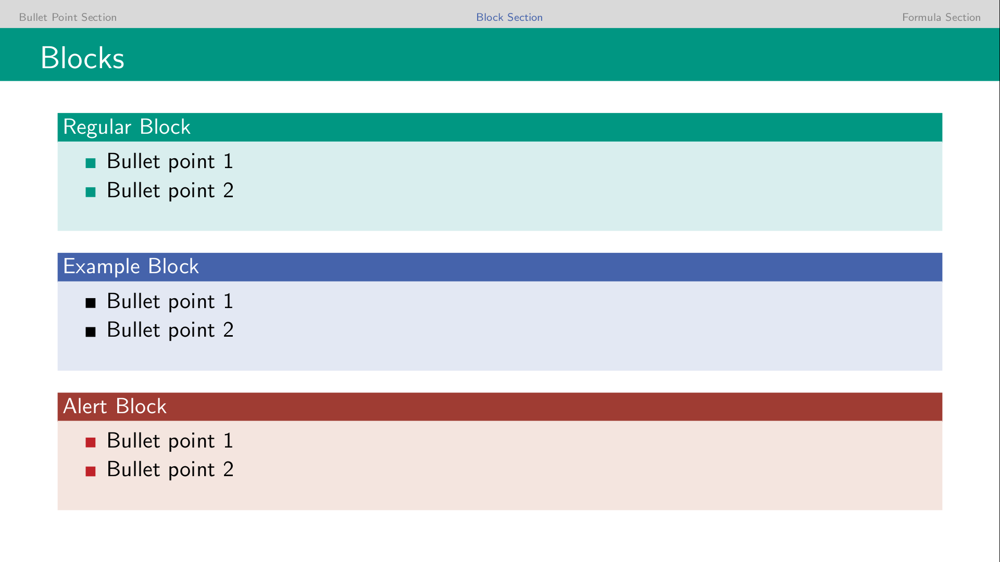
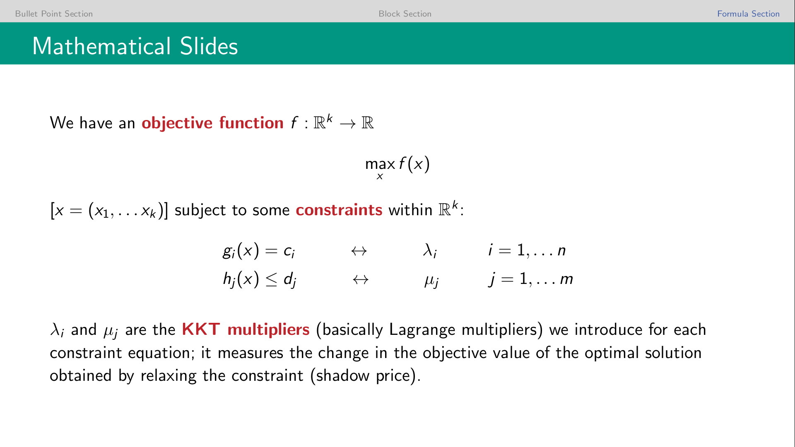

# Modern LaTeX Beamer for Karlsruhe Institute of Technology (KIT)

This is a lightweight *inofficial* LaTeX beamer theme for presentations of the Karlsruhe Institute of Technology (KIT).

Using colours compatible to [KIT corporate design][corporate] it offers a modern twist on the antiquated [official KIT presentation template][template].

If you know how to improve things, don't hesitate to fork away! Thanks for [inspiration][inspiration].

## Usage

To use it just place the `.sty` files where LaTeX can find them (e.g. your project folder) and include `\usetheme{Karlsruhe}` in the preamble of your `.tex` file.

You can also use the colour theme `beamercolorthemeKarlsruhe.sty` separately with other themes via `\usecolortheme{Karlsruhe}`.

These colour aliases are available for use with `textcolor{kit-blue100}{example text}`. 

If you would like to have a frame containing the section title at the beginning of each new section, use the option `\usetheme[sectionslides]{Karlsruhe}`.

You may also find it convenient to start with the ready-to-use `example.tex` file which includes a few additional design tweaks. 

## Example

[corporate]: http://intranet.kit.edu/gestaltungsrichtlinien.php
[template]: https://sdqweb.ipd.kit.edu/wiki/Dokumentvorlagen
[inspiration]: https://github.com/pazz/beamerthemeEdinburgh

